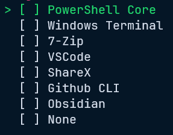
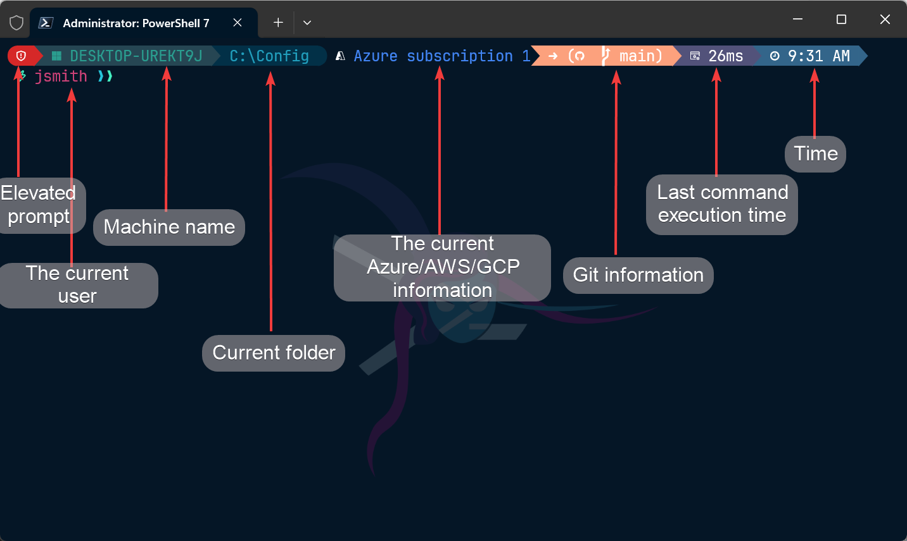

## Introduction

As most tech professionals can probably attest to, the setup of your digital workspace is personal and things just don't feel right if it isn't done. We're also the same type of people that like to squeeze every bit of efficiency out of our time that we can and are constantly looking for improvements.

To that end, I have landed on the below config to get my base workstation setup so I can be productive. I'll go through some of the features and reasons for the decisions I've made and hopefully you can take something away and make it your own.

## Installation

Firstly you'll need to install Git if you don't already have it isntalled. You can do that on windows 10+ using Winget.

```bash
winget install Git.Git --exact --silent --accept-package-agreements --accept-source-agreements
```

Otherwise you can find the Git installation files on [git-scm.com](https://git-scm.com/).

Once you have installed Git, you'll need to clone my config repo somewhere. for this example I'm going to use ```C:\Config```. I use [Git submodules](https://git-scm.com/docs/git-submodule) to pull in the [pwsh-menu](https://github.com/Sup3rlativ3/ps-menu) module so you'll need to ensure that you include that when you clone the repo.

```PowerShell
git clone --recurse-submodules https://github.com/DevOpsDownUnder/my-windows-config C:\Config
```

Once you have the repo downloaded, you'll need to run the ```./Install-Profile.ps1``` script to kick things off.

```PowerShell
Set-Location C:\Config
. .\Install-Profile.ps1
```

Use the up and down arrows to move through the menu. Space bar will select/unselect an item and Enter will install the selected items.



## Prompt



Here are some of the features in the prompt:

* Alert if you are in admin mode.
* Computer name.
* Current directory.
* Information about the current active Azure/AWS/GCP account.
* Git branch and commit information.
* Execution time for the previous command.
* Time the previous command finished.
* Backgrounds for posh/pwsh differation.
* Colours and icons for different items in  directory listings.
* Prompt colour themes.
* Quake mode enabled (Ctrl+Shift+D).

## Applications

* Windows Terminal.
* ShareX.
* VSCode.
* Github CLI.
* 7-Zip.
* Pwsh.
* Obsidian.

## Windows Terminal

Windows terminal was chosen as the terminal emulator for its features (Quake mode anybody?), ease of use, and customisability.

## ShareX

ShareX is easily the best screenshot tool for windows and it is super lightweight too.

## VSCode

Default editor with a million available plugins that will suit almost all coding work you will need to do. Some commong plugins are also installed for code.

* PowerShell.
* GitLens.
* Material Icon theme.
* One-Monokai theme.
* Github PR (Used for authentication).
* Markdown lint.
* Prettier.

## Github CLI

Mostly used for authentication to Github and swapping accounts easily in the cli.

## 7-Zip

The best archive tool for Windows.

## Pwsh

The current default version of Powershell. Not installed on all versions by default hence why it is here.

## Obsidian

This is my note taking application of choice. Everything is written in markdown and then I sync my knowledgebase repo with git for built-in versioning and history. Obsidian also has a log of plugins to make note taking much easier.

If you add your Obsidian vault/s to a git repo, make sure to add ```*workspace.json``` to your .gitignore file or you're going to have a bad time mmmkay?